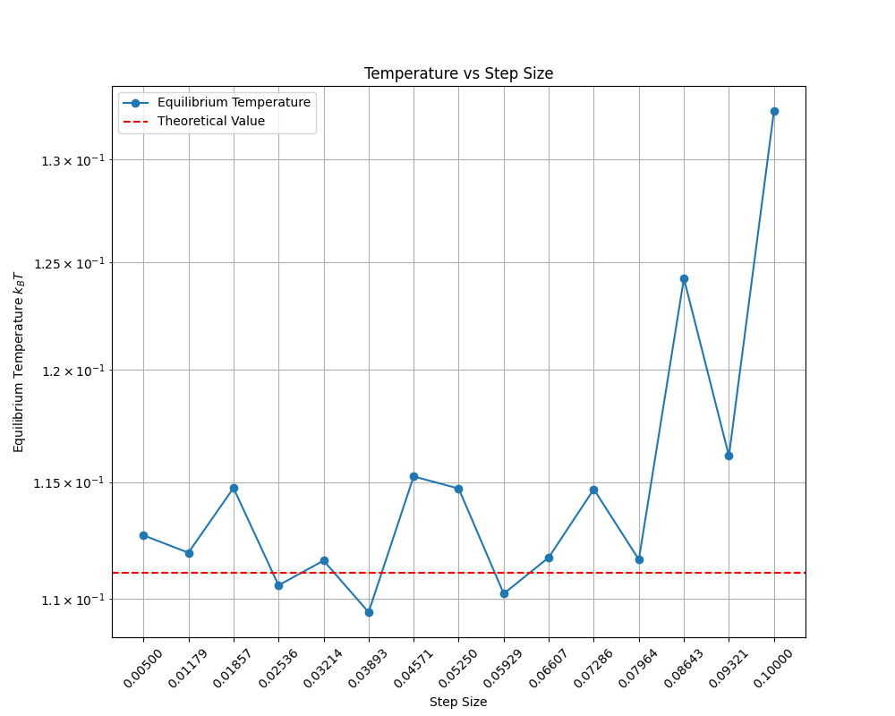

# Dissipative Particle Dynamics (DPD)

This repository contains a Python implementation of the Dissipative Particle Dynamics (DPD) method following the Groot and Warren model. The code is designed to simulate the dynamics of a system of particles interacting through soft potentials, with the ability to include hydrodynamic interactions.

# Results

# Equilibrium temperature as a function of time step

The variation of the equilibrium temperature with respect to the time step is shown in Figure 1. The red line indicates the theoretical value of the temperature, i.e. $k_BT = \frac{\sigma^2}{2\gamma} = 0.1111$, while the blue line indicates the value obtained from the simulation.

<figure>
  

 
  

 <figcaption><em> Figure 1: Equilibrium temperature as a function of time step. The red line indicates the theoretical value of the temperature, while the blue line indicates the value obtained from the simulation.</em></figcaption>
</figure>

The results suggest that the system reaches a stable temperature for small time steps around $10^{-1}$ while larger time steps lead to deviations from the expected value.

