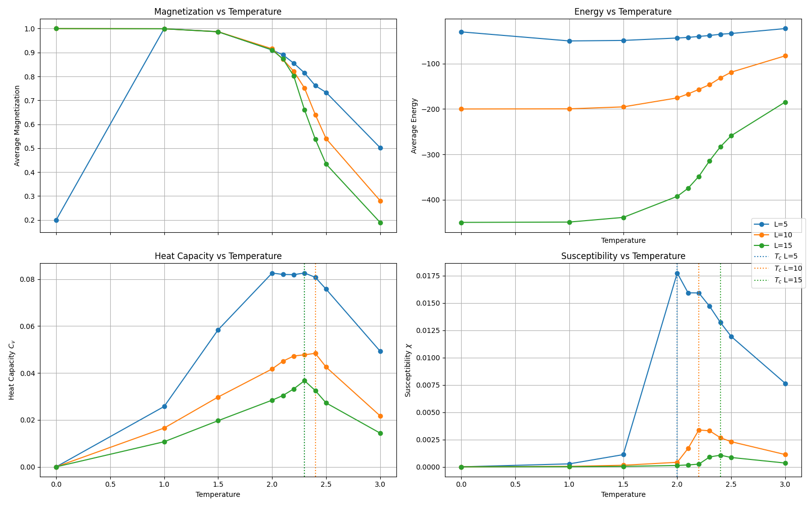
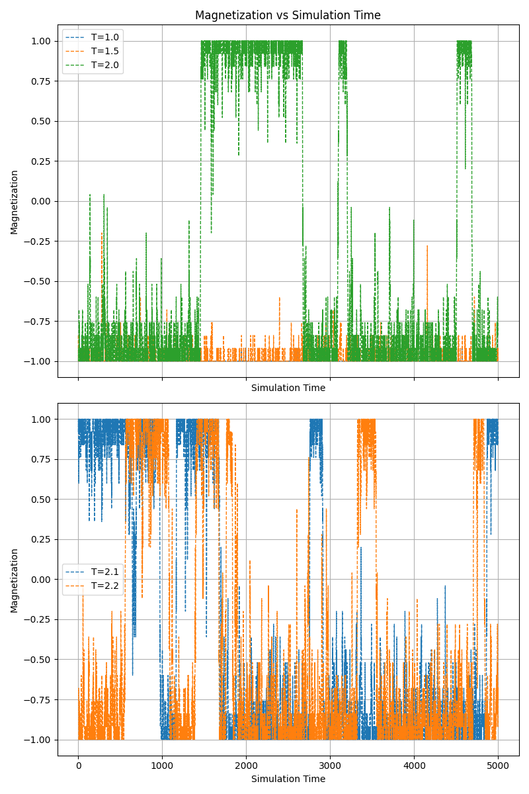

# Monte Carlo simulation for Ising Model

## 1. Derivation of $\Delta E$

Given the Hamiltonian for the Ising model:

```math
E = H(\{\sigma\}) = -J \sum_{\langle i,j \rangle} \sigma_i \sigma_j
```

where:

- $\sigma_i \in {\plusmn 1}$ is the spin at site $i$
- $J$ is the coupling constant
- $\langle i, j \rangle$ means the sum runs over all pairs of nearest neighbors (up, down, left, right)

The energy difference:

```math
\Delta E = E(X) - E(Y)
```

where $E(Y)$ is the energy of the system after flipping a single spin $\sigma_i$ to $-\sigma_i$, can be derived as follows.

---

The contribution to the total energy from spin $\sigma_i$ interacting with its neighbors $\sigma_j$ is:

```math
E_i = -J \sum_{\langle i,j \rangle} \sigma_i \sigma_j = -J \sigma_i \sum_{\langle i,j \rangle} \sigma_j = -J \sigma_i h_i
```

After flipping $\sigma_i$ to $-\sigma_i$, its contribution becomes:

```math
E_i' = -J (-\sigma_i) \sum_{\langle i,j \rangle} \sigma_j = J \sigma_i h_i
```

The change in energy due to flipping $\sigma_i$ is the difference between the new and the old contribution:

```math
\begin{aligned}
\Delta E & = E_i' - E_i = \left( J \sigma_i h_i \right) - \left( -J \sigma_i h_i \right) \\
& =  J \sigma_i h_i + J \sigma_i h_i = 2J \sigma_i h_i
\end{aligned}
```

concluding that the energy difference caused by flipping spin $\sigma_i$ is:

```math
\boxed{ \Delta E = 2J \sigma_i h_i }
```

where:

- $h_i = \sum_{\langle i,j \rangle} \sigma_j$: the sum of the four nearest neighbor spins around $i$
- $J$: the coupling constant that describes the strength of interaction between neighboring spins

## 2. Analysis of results

> [!NOTE]
> The temperature $T=0.0$ has been encoded in $T=1\cdot 10^{-6}$ to improve the numerical stability of the algorithm. However, for small lattices, i.e. $L=5$, it still gives unstable results.

### a) Determine the critical temperature and b) Results varying the lattice size

<figure>
    
    <figcaption>Figure1: Magnetization, Energy, Capacity, and Susceptibility in function of Temperature</figcaption>
</figure>

a) The critical temperature $T_c$ corresponds to the peak in the Heat Capacity $C_v$ or the Susceptibility $\chi$. In the two bottom plots the $T_c$ is highlighted by a vertical dotted line, accordingly colored. We can observe that the peaks are around the theoretical $T_c \approx 2.269$ for $L\rightarrow\infty$, however small deviations are due to the limited $L$ used in this study.

b) Increasing the system size $L$ we observe a sharper drop in average magnetization around $T_c$ as expected getting closes to the ideal condition of $L\rightarrow\infty$. In contrast, with lower sizes we have the opposite behaviour. In the energy plot we have a symmetric behaviour as expected, starting from lower energies to higher ones. As the lattice size $L$ increases we have a sharper drop.

### c) Sing-flips in average magnetization $M$

<figure>
    
    <figcaption> Figure 2: Average Magnetization, in function of the simulation time (with L=5000 and configuration of the remaining parameter as provided in the requirements.) </figcaption>
</figure>

Focusing on a single color at each time, we observe phase flips for values of temperature $T \ge 2$. The frequence of phase flips is observed to be increasing with the temperature vlaue.
