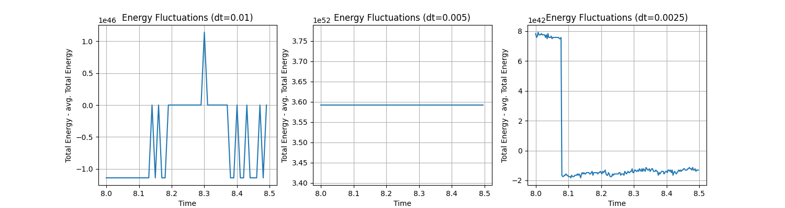
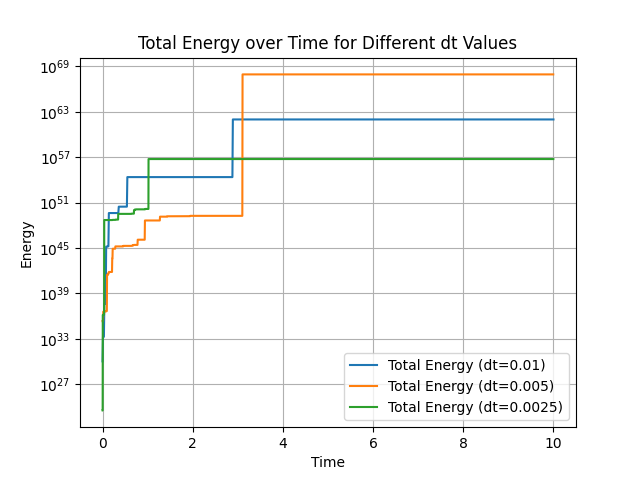
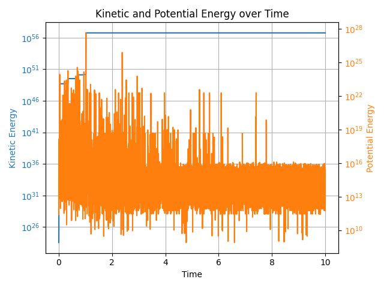
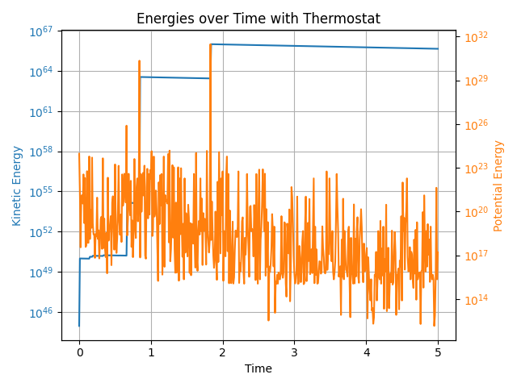
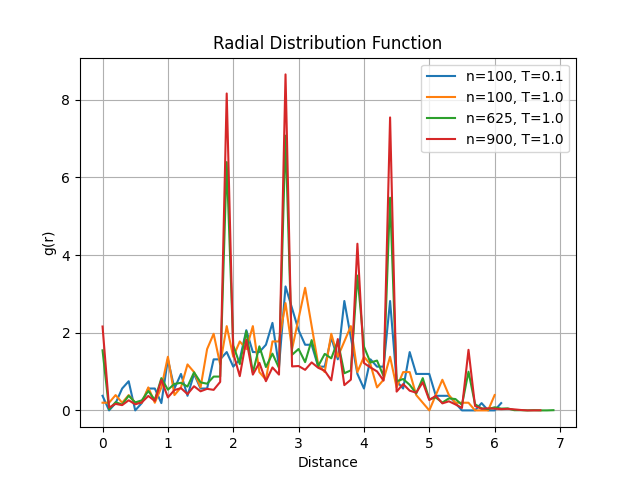

# Molecular Dynamics based on Lennar-Jones potential

 This project implements a molecular dynamics simulation using the Lennard-Jones potential to model interactions between particles. The goal is to study the behavior of particle systems under various conditions.

## Implementation details

The relevant implementation choices are listed below:

- The data structure for the particles is implemented as a list of cells (i.e. list of `Particle` objects), each containing pointers to `Particle` objects. It should have performance comparable to the usual implementation where cell-list contains the index of a given particle, and particles are stored in another array as pointers are handled in a similar manner to integers. For better performances other programming languages with explicit memory management should be preferred.
- The particles' initial velocity is drawn from a normal distribution and then normalized to get zero total momentum in each dimension setting the kinetic energy associated to the desired temperature.

## Results

### a) Simulations without termostat

Total momentum is conserved only for limited number of particles in the environment (i.e. $N\le30$), with negligible dependence on the environment size $L$.

These simulations have been run with $T=3$, $N=400$, and $dt\in\{ 0.01, 0.005, 0.0025\}$. Other parameters are set as in the project requirements.

The size of energy fluctuations dependence on the used time step $dt$ is represented in Figure 1.

<figure>
 

 
 <figcaption><em> Figure 1: Energy fluctuations for different time steps dt. </em></figcaption>
 

</figure>

The fluctuations in the total energy have a irregular behavior that empirically from Figure 1 seems not to be correlated to the step size.

To identify the time steps necessary to reach the equilibrium, Figure 2 shows the evolution in time of the total energy for different $dt$ and the evolution of kinetic and potential energy for $dt=0.0025$.

<figure>
 
 
 <figcaption><em> Figure 2: (Left) Energy evolution as function of time for different time steps dt. (Right) Kinetic and potential energy for dt=0.0025 as function of time. </em></figcaption>
</figure>

We observe that from $t\ge3$ time units the simulation reaches an equilibrium for $dt=0.05$ while from $t\ge1.5$ for for $dt=0.0025$. The evolution of kinetic and potential energy for this last $dt$ value, however shows that kinetic energy stabilizes around $t\ge4$. From the left plot we can see that after $k=\frac{1.5}{0.0025}=\frac{3}{0.005}=600$ iterations, the system reaches a stable state.

### b) Simulations with thermostat

The implementation with the Berendsen thermostat is tested with the provided parameters. The results are shown in Figure 3 for the timesteps to reach equilibrium and in Figure 4 for the radial distribution function.

<figure>
 

 <figcaption><em> Figure 3: Energy evolution as function of time. </em></figcaption>
</figure>

From Figure 3 we can see that the system reaches equilibrium almost instantaneously after initialization for what concerns the kinetic energy, while the potential energy stabilizes around $t\ge1.8$. The Berendsen thermostat seems to work well in maintaining the temperature of the system.

<figure>
 
 <figcaption><em> Figure 4: Radial distribution function of particles within neighbouring cells. </em></figcaption>
</figure>

The radial distribution function is computed for the system with different parameters and only within the neighbour cells. The plot shows the expected behavior of the radial distribution function, with peaks corresponding to the positions of the particles in the system in an organized structure. It is limited for very small distances due to strong repulsive forces. However, noise is present in the plot as the system is not perfectly ordered and the initialization is random and not in a lattice structure. Finally, the rhs of the plot decreases to 0 as we only consider neighbour cells, i.e. the maximum distance is the diagonal of two cells $2 \cdot 2.5 \cdot \sqrt 2 = 7.07$.
