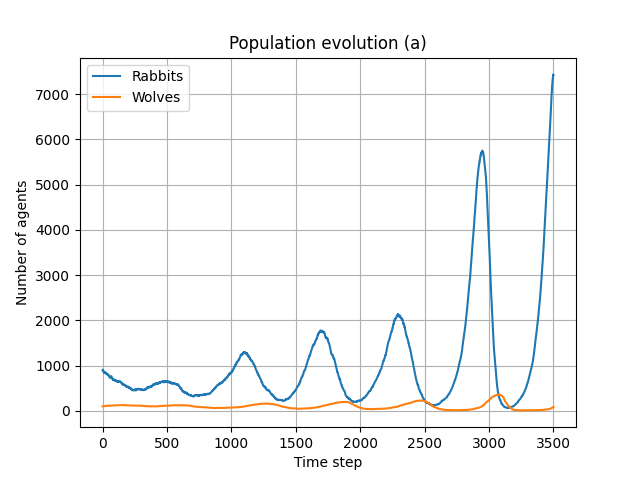
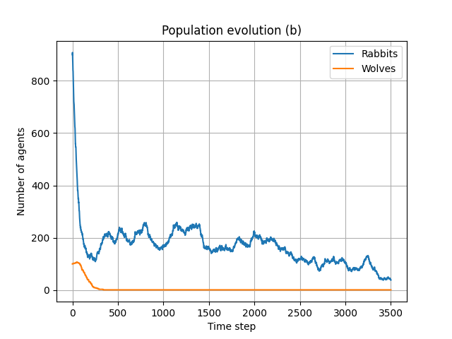
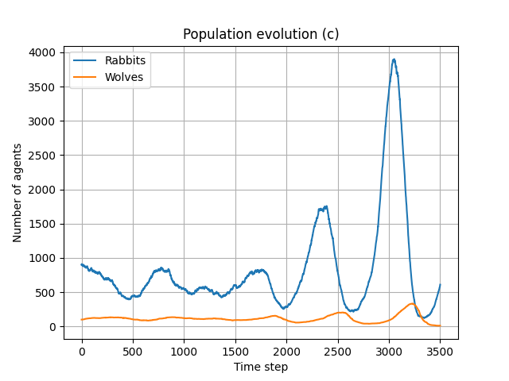
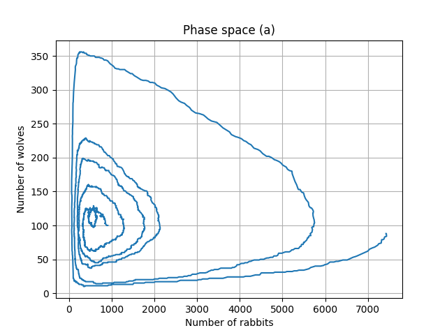
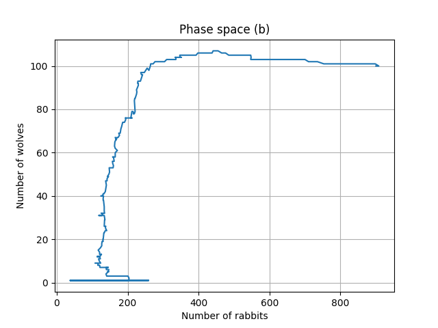
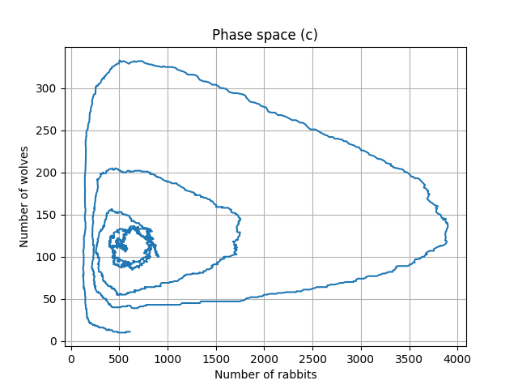

# Prey-Predator population dynamics

This project focuses on implementing a variation of the prey-predator model in 2D using particle methods. The simulation will model the interactions between rabbits (prey) and wolves (predators) in a periodic 2D habitat. The objective is to analyze the population dynamics under different conditions and compare the results with the Lotka-Volterra equations. The Lotka-Volterra model describes, inter alia, the dynamics of biological systems in which two species interact, one as a predator and the other as prey.

## a) Study similarities to the Lotka-Volterra model

The first simulation has been run with step size parameter $\sigma_r=\sigma_w=0.5$ both for rabbits and wolves and assuming rabbits die at the age of $t_r = 100$ while wolves at $t_w=50$ time steps.

<figure>
 
 <figcaption><em> Figure 1: Population for wolves and rabbits as function of time with the initial parameter configuration (i.e. point a). </em></figcaption>
</figure>

In Figure 1 we provide the results as function of time for the first simulation. Here we note the oscillatory nature of the population of both species. Although there is a tendency for the rabbits' population to follow an exponentially increasing trend, we observe the periodicity of the fluctuations in both populations. In particular, the two densities are in phase quadrature, i.e. $\pi/2$ phase delay for the predator population.

## b) Population equilibrium with reduced rabbits' lifespan

We now reduce the rabbits' lifespan to match the one for wolves $t_r?t_w=50$. All the other parameters are left as before and same for both species. Doing so, we try to reach an equilibrium state.

<figure>
 
 <figcaption><em> Figure 2: Population for wolves and rabbits as function of time with same lifespan for both species (i.e. point b). </em></figcaption>
</figure>

In Figure 2 we note that the oscillatory behaviour is almost gone for both populations. Predators quickly tend to a population near zero, while preys have an irregular noisy trend with small variations in the order of $10^{-1}$ compared to the previous simulation at a). Given that, it can be considered as a noisy equilibrium state.

## c) Reduced interaction threshold

In the final simulation we lower the interaction radius from $r=0.5$ to $r=0.05$, keeping all the other parameters as in point a).

<figure>
 
 <figcaption><em> Figure 3: Population for wolves and rabbits as function of time with reduced interaction radius (i.e. point c). </em></figcaption>
</figure>

Figure 3 illustrates the population dynamic for this last setting. We observe an irregular behaviour that shifts from an almost-equilibrium state to an oscillatory population in phase quadrature. However, due to the absence of periodicity along all the domain, Lotka-Volterra equations may not be approximate well this population dynamic.

## Final remark on phase space plots

To confirm the results presented above we present also the phase space plots for the three environments presented above.

The ideal phase space plot for a single configuration should be a single loop-closed line. Case a) is the most similar, however we note that the line is diverging preventing the loop-closure. This is due to the increasing amplitude of the oscillations in time. Case a) also shows points near (0,0) as in the ideal case.

For case b) where we have the equilibrium there is no sight of the ideal behaviour as expected, while in the last case c) it shows slight similarities but quite far from the ideal case and just for the high-amplitude oscillations.

<figure>
 
 
 

 <figcaption><em> Figure 4: Phase space plots for population of wolves over population of rabbits for the three simulations a), b), c). </em></figcaption>
</figure>